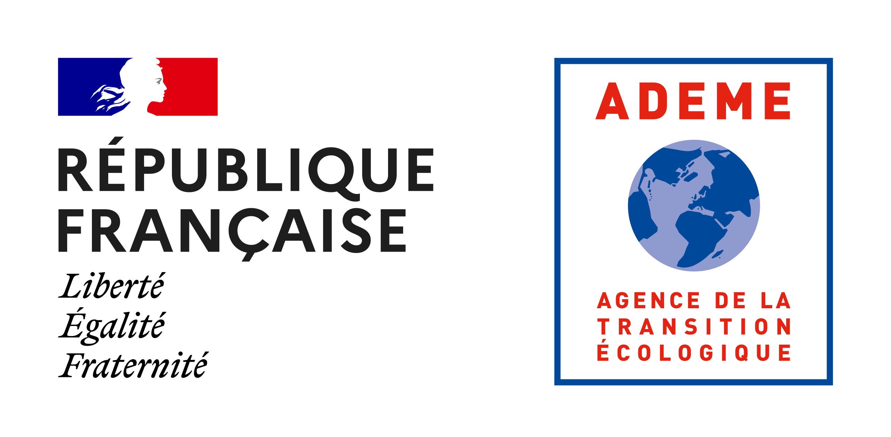

```{r, echo=FALSE, message=FALSE, include=FALSE}
options(htmltools.dir.version = FALSE)
knitr::opts_chunk$set(fig.align = "center", 
                      message = FALSE, 
                      warning = FALSE, 
                      paged.print = FALSE)

library(tidyverse) # Easily Install and Load the 'Tidyverse'
```

# Encadrement de la thèse
.pull-left[
## Florent Mouillot
Chargé de recherche IRD
- Régime de feux
- Cycles biogéochmique
- Methodes et outils de détection et d'analyse 


]

.pull-right[
##Xavier Morin
Directeur de recherche CNRS
- Modèles de dynamique forestière
- Relation diversité-fonctionnement
- Utilisation des inventaires forestiers


----

*Département Ecologie Fonctionelle*

**Equipe FORECAST** : FOREts, Changements globaux, et Adaptation: Simulations et expérimenTations

Représentante de l'UMR au comité de suivi : Mme Sarah Cubaynes

Représentant extérieur à l'UMR : Mr Thomas Lauvaux
]


---
#Financement de la thèse

.pull-left[
##ADEME : Agence de la transition écologique
**Financement national**

Employeur de la thèse 

Référente ADEME au comité de suivi : Mme Miriam Buitrago


]

.pull-right[
## FirEUrisk european project - IRD

**Financement européen**

Référent IRD au comité de suivi : Mr Raphaël Pélissier


]
---
#ADEME : Agence de la transition écologique
.left-column[

- 3 comité de suivi/pilotage
- 3 rapport d'avancement
]
.right-column[]
---
#FirEUrisk european project - IRD
.left-column[


]
.right-column[]
---
#FirEUrisk european project - IRD
.pull-left[]
.pull-right[

]
---
#Ecole Doctorale
- 2 Comité de suivis
- Participation à une conférence internationale
- Validation de 90 heures de formations doctorale :
  - Formation proposées par l'ED ou le collège doctorale
  - Formation hors catalogue et MOOC
  - Participation à des séminaires nationaux et internationaux (présentation ou poster)
  - Vulgarisation scientifique
  


.pull-left[]
.pull-right[

]
---
#Ecole Doctorale


---
# Plan de thèse

---
# Plan de thèse


---
# Tâche 1 : Reconstitution des surfaces incendiées FORETS


---
# Tâche 1 : Reconstitution des surfaces incendiées FORETS


---
# Tâche 1 : Reconstitution des surfaces incendiées FORETS


---
# Tâche 1 : Reconstitution des surfaces incendiées AGRICOLES

---
# Tâche 1 : Reconstitution des surfaces incendiées AGRICOLES
## Global dataset
**12453** observations de 2000 à 2021, avec

- 8408 feux agricoles
  - 6008 feux de champs
  - 2400 feux de bâtiments
- 1577 feux pastoraux


5 types de variables :

- Date (jour/mois/année)
- Commune de l'évènementt (Nom and code INSEE)
- Localisation de la commune (Latitude et Longitude)
- Type de vegetation
- Source de la donnée

Variables additionnelles :
- Surface brulée pour les feux de champs
- Type de stockage et estimation du poids sec brulée pour les feux de bâtiments
---
# Tâche 1 : Reconstitution des surfaces incendiées AGRICOLES

---
# Tâche 1 : Reconstitution des surfaces incendiées AGRICOLES
## Distribution spatiale


---
# Tâche 1 : Reconstitution des surfaces incendiées AGRICOLES
## Dynamique temporelle


---
# Tâche 1 : Reconstitution des surfaces incendiées AGRICOLES
## Dynamique temporelle
